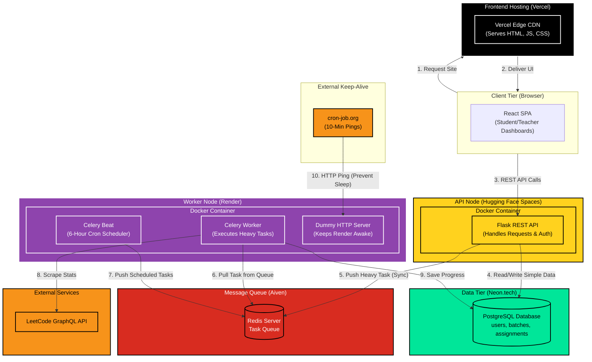

# LeetPulse Architecture

This document provides a comprehensive, highly detailed technical overview of the LeetPulse platform architecture. It details exactly how every single component communicates, the step-by-step flow of data, and the reasoning behind each technology choice in our distributed microservice system.

## 1. High-Level Architecture Diagram

The following diagram illustrates the decoupled flow of data across the Frontend, API Node, Message Broker, Background Worker, and Database.

---

## 2. Component Deep-Dive & Connection Flow

This architecture is broken down into specific microservices, ensuring that heavy background tasks do not slow down the user experience. 

### A. The Frontend (Vercel)
* **Technology:** React 18, TypeScript, Vite, Tailwind CSS.
* **Purpose:** Handles all user interface interactions and displays data instantly.
* **How it connects:** It is a Single Page Application (SPA). Vercel acts strictly as a global CDN to deliver the HTML/JS/CSS files to the user's browser. The browser then makes HTTP requests directly to the Hugging Face API Node.
* **Why Vercel?** Best-in-class global CDN, instant deployments, and an excellent free tier for static assets.

### B. The API Node (Hugging Face Spaces)
* **Technology:** Python, Flask, Flask-CORS, PyJWT, SQLAlchemy.
* **Purpose:** The traffic controller. It authenticates users, serves quick database queries (like viewing the dashboard), and delegates heavy work.
* **How it connects:** 
  * Connects to the **Neon Database** directly to fetch basic user data.
  * When a user clicks "Sync LeetCode Status", Flask does **not** do the heavy scraping. Instead, it writes a small message (e.g., "Task: Sync Student 123") and pushes it to the **Aiven Redis Queue**, then immediately replies `200 OK` to the frontend so the user doesn't have to wait.
* **Why Hugging Face?** Offers a massive 16GB of RAM and 2 vCPUs completely for free on their Docker tier, which is perfect for a robust, high-traffic API node.

### C. The Message Broker (Aiven Redis)
* **Technology:** Redis.
* **Purpose:** The "Waiting Room" for tasks. It safely holds tasks pushed by the API Node until the Worker Node is ready to process them.
* **Why Aiven?** Aiven provides a highly secure, managed Redis instance with a generous free tier. Using a centralized Redis queue allows us to decouple the API from the Worker—if 1,000 students click "Sync" at the same time, the API won't crash; the tasks just sit securely in Redis until processed.

### D. The Worker Node (Render)
* **Technology:** Celery, Celery Beat, Python 3.10.
* **Purpose:** The heavy lifter. It asynchronously processes the heavy LeetCode scraping tasks without freezing the API.
* **How it connects:**
  * **Celery Worker:** Constantly listens to the **Aiven Redis** queue. When it sees a task, it pulls it, connects to the LeetCode GraphQL API to scrape data, and writes the results to the **Neon Database**.
  * **Celery Beat:** An internal alarm clock. Every 6 hours, it automatically generates "Sync All Students" tasks and pushes them into Redis for the worker to process.
* **Why Render?** Excellent free-tier Docker hosting that allows us to run custom long-running background processes (Celery). 

### E. The Free-Tier Keep-Alive Hack (cron-job.org)
* **The Problem:** Render forces free "Web Services" to sleep after 15 minutes of inactivity. If the worker sleeps, automated background syncs stop working.
* **The Solution:** We run a tiny `python -m http.server` in the background on Render alongside Celery. We then use **cron-job.org** to send an HTTP ping to this dummy server every 10 minutes.
* **Why?** Render sees this HTTP ping as "active web traffic", completely resetting the 15-minute sleep timer. This effectively gives us a 24/7 constantly-awake Background Worker for $0.00.

### F. The Database (Neon.tech)
* **Technology:** Serverless PostgreSQL, SQLAlchemy, Psycopg (v3).
* **Purpose:** The single source of truth for persistent state (users, assignments, progress).
* **Why Neon?** Separates storage and compute. It is a modern, serverless Postgres provider that scales instantly to zero and offers a massive free tier, making it the perfect central database for a distributed architecture.

---

## 3. End-to-End Workflow Examples

### Flow #1: The Manual Sync (User clicks a button)
1. **Frontend:** Student clicks "Sync LeetCode Status". Vercel sends an HTTP POST request to the Hugging Face API.
2. **API Node:** Hugging Face receives the request, validates the JWT token, and drops a message into the Aiven Redis queue. It instantly replies "Sync Started" to the Frontend.
3. **Queue:** Redis holds the task securely.
4. **Worker Node:** The Render Celery worker grabs the task from Redis, reaches out to LeetCode, parses the GraphQL response, and updates the student's row in the Neon Database.
5. **Frontend:** The student refreshes their page, and the new data is loaded from Neon.

### Flow #2: The Automated Nightly Sync (The Cron Job)
1. **Worker Node (Beat):** At exactly the 6-hour mark, Celery Beat wakes up inside Render.
2. **Task Generation:** It looks at the Neon database, finds 100 active students, and throws 100 individual "Sync Student" tasks into the Aiven Redis queue.
3. **Queue & Worker:** The Celery worker pulls the 100 tasks out of Redis as fast as it can. Because they are in a queue, they are processed reliably in parallel without overwhelming the memory limits of the server.
4. **Result:** When the Teacher wakes up the next morning, the Vercel frontend dashboard shows 100% accurate, up-to-date data for the entire class.

---

## 4. Key System Design & Architectural Decisions

When architecting LeetPulse, several key technical decisions were made to elevate the platform from a simple hobby application to an **Enterprise-Grade Distributed System**. Below are the specific trade-offs and reasoning behind these choices:

### A. Distributed Task Queue (Celery + Redis) vs. Simple In-Memory Schedulers (APScheduler)
**The Easy Option:** Use a simple Python library like `APScheduler` or native Flask threading to run background loops directly inside the API server.
**Why we rejected it:** 
1. **API Freezing (The GIL Problem):** Python's Global Interpreter Lock (GIL) means heavy scraping tasks would choke the web server. If APScheduler looped over 500 students, the entire Flask API would freeze, preventing other users from logging in or viewing their dashboards.
2. **Data Loss:** If the Hugging Face server restarted halfway through a 500-student loop, the remaining 250 tasks would be permanently lost in memory.
**Our Production Approach:** We introduced **Celery and Aiven Redis**.
*   **Separation of Concerns:** The API Node instantly delegates tasks to Redis and replies to the user in milliseconds. 
*   **Zero Data Loss:** Tasks sit safely in the persistent Redis database. If the Render Worker crashes, another worker picks up the exact task from the queue upon reboot.
*   **Horizontal Scalability:** We can infinitely scale the Worker Nodes on Render without ever touching the API Node.

### B. Distributed Rate Limiting (Protecting External Dependencies)
**The Easy Option:** Just fire HTTP requests to the LeetCode GraphQL API as fast as possible.
**Why we rejected it:** External APIs have strict rate limits. Firing 200 simultaneous requests would result in an immediate `429 Too Many Requests` error and a permanent IP ban from LeetCode for our Render server.
**Our Production Approach:** Celery natively supports distributed rate limiting (`rate_limit='30/m'`). By routing all scraping tasks through the centralized Redis queue, we guarantee that no matter how many Worker machines we spin up, we will never hit LeetCode more than 30 times per minute. This ensures 100% stability and compliance with external API limits.

### C. Stateless JWT Authentication vs. Server-Side Sessions
**The Easy Option:** Use Flask server-side sessions (cookies) to keep users logged in.
**Why we rejected it:** In a distributed architecture where the frontend (Vercel) and backend (Hugging Face) live on entirely different domains, managing CORS and cross-site cookies is complex and prone to browser-level security blocks (like Safari's ITP). Furthermore, server-side sessions require storing session data in memory or the database, which hurts scalability.
**Our Production Approach:** We use **Stateless JSON Web Tokens (JWT)**. The Hugging Face API issues a signed token, and the React frontend stores it in `localStorage`. Every API request includes this token in the `Authorization: Bearer` header. This completely eliminates CORS cookie issues and allows the API to remain perfectly stateless and horizontally scalable.

### D. Registration Spam Prevention (B2B SaaS Security)
**The Easy Option:** Leave the "Register as Teacher" endpoint completely open to the public.
**Why we rejected it:** Malicious bots and random users would flood the database with fake teacher accounts, creating empty batches and polluting the platform.
**Our Production Approach:** We implemented an **Environment-Level Access Code** (`TEACHER_SECRET_CODE`). When someone attempts to register as a Teacher, the backend strictly verifies this code against the live server's environment variables (stored securely in Hugging Face Secrets). This instantly stops 100% of bot spam without requiring the complex engineering overhead of building an "Admin Manual Approval" dashboard.
