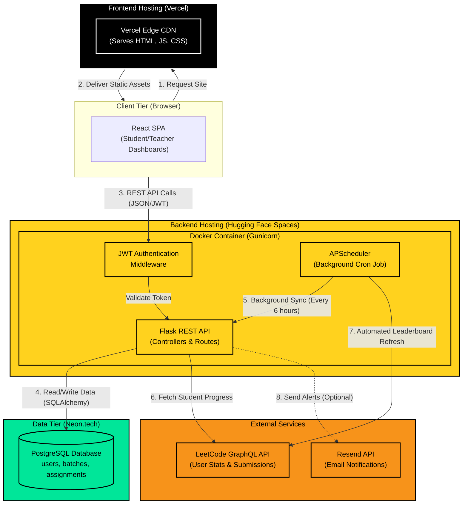

# LeetPulse Architecture

This document provides a comprehensive, highly detailed technical overview of the LeetPulse platform architecture, detailing exactly how every single component communicates, where data is stored, and where the code is hosted in production.

## 1. High-Level Architecture Diagram

The following diagram illustrates the flow of data across the Client, Frontend Hosting, Backend API, Database, and External Services.

---

## 2. Component Deep-Dive

### A. The Frontend (Vercel)
**Technology:** React 18, TypeScript, Vite, Tailwind CSS, Lucide React (Icons).
**Hosting:** Vercel (Production) / Vite Dev Server (Local).
**Purpose:** Handles all user interface interactions. It is a Single Page Application (SPA).
**How it connects:**
- Vercel strictly serves static files (`index.html`, JavaScript bundles). It executes *no backend logic*.
- We use a `vercel.json` file with a "rewrite" rule. If a user manually refreshes `/student`, Vercel serves `index.html` and lets React Router handle the URL.
- It communicates with the backend via `axios`. It pulls the backend URL dynamically using the `VITE_API_URL` environment variable.

### B. The Backend API (Hugging Face Spaces)
**Technology:** Python, Flask, Flask-CORS, PyJWT, SQLAlchemy.
**Hosting:** Hugging Face Spaces (Docker SDK tier - 16GB RAM Free).
**Purpose:** Acts as the brain of the application. It secures data, validates business logic, and orchestrates background jobs.
**How it connects:**
- Hugging Face automatically reads the `backend/Dockerfile`, installs `requirements.txt`, and spins up a Gunicorn web server mapped to port `7860`.
- **Authentication:** All protected routes are wrapped in a `@token_required` decorator. When a user logs in, Flask creates a JWT (JSON Web Token) signed with `JWT_SECRET`. The frontend stores this token and passes it in the `Authorization` header of every subsequent API call.

### C. The Background Scheduler (In-App Cron)
**Technology:** APScheduler (Advanced Python Scheduler).
**Location:** Runs as a background thread directly inside the Flask container.
**Purpose:** Eliminates the need for expensive external task queues (like Celery + Redis). 
**How it connects:**
- When Flask boots up, it starts the `BackgroundScheduler`.
- Every 6 hours, it automatically fires `sync_all_active_students()`.
- This function queries the Neon database for all users, makes requests to the LeetCode API to get their fresh stats, and saves the new data back to Neon. This ensures the Teacher's leaderboard is always fresh without students having to click the "Sync" button.

### D. The Database (Neon.tech)
**Technology:** Serverless PostgreSQL.
**Hosting:** Neon.tech (Free Tier).
**Purpose:** The single source of truth for all persistent state.
**How it connects:**
- Flask connects to Neon using `SQLAlchemy` and the `psycopg2` driver.
- The connection is established via the `DATABASE_URL` environment variable injected securely into the Hugging Face space.
- Contains normalized relational tables: `users` (Teacher/Student), `batches`, `assignments`, `assignment_problems`, and `student_progress` (which tracks `PENDING`, `ON_TIME`, `LATE`, `MISSED` states).

### E. External Data Scraping (LeetCode API)
**Technology:** GraphQL over HTTP.
**Purpose:** Tracking student progress automatically without relying on their honesty.
**How it connects:**
- The Flask backend sends POST requests to `https://leetcode.com/graphql` querying the `userRecentSubmissions` and `userProblemsSolved` endpoints.
- It parses the JSON response to calculate global leaderboard scores and match submitted problem slugs to active assignment deadlines.

---

## 3. Why This Architecture Was Chosen (The $0 Production Model)

The primary goal of this architecture was to build a highly scalable, real-time education platform with a **$0.00 monthly operational cost**. 

1. **Why Vercel?** Best-in-class global CDN for React Vite applications. Generous free tier.
2. **Why Hugging Face?** Traditional free tiers (like Render or Heroku) sleep after 15 minutes of inactivity and offer very little RAM. Hugging Face Spaces (Docker tier) offers a massive 16GB of RAM and 2 vCPUs completely for free, allowing us to run background cron jobs without the server constantly going to sleep.
3. **Why Neon PostgreSQL?** Neon separates storage and compute. It is a modern, serverless Postgres provider that offers an excellent free tier and integrates natively with Python's SQLAlchemy.
4. **Why APScheduler instead of Celery/Redis?** Introducing Redis and Celery would require a separate worker server and a separate Redis database (which are rarely free at scale). Because Hugging Face gives us 16GB of RAM, we easily have enough memory to run background threads *inside* the main web server using APScheduler, drastically simplifying deployment and saving money.
